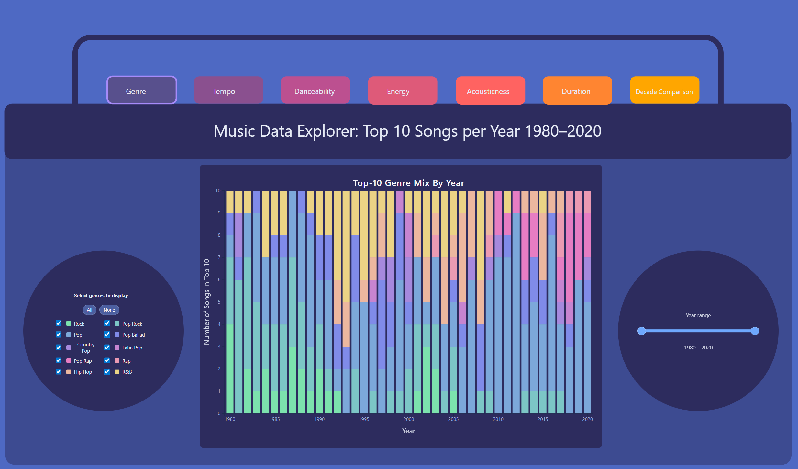
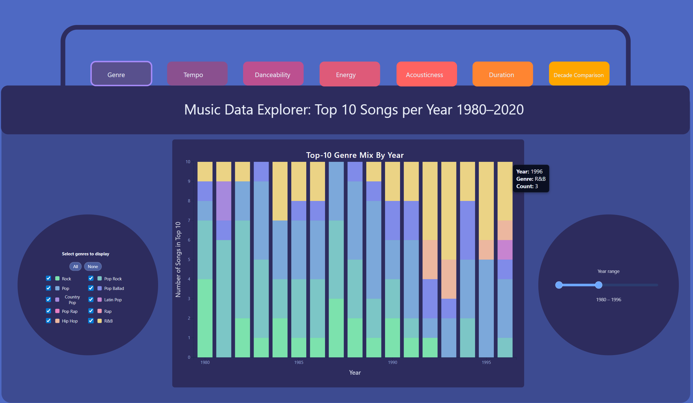
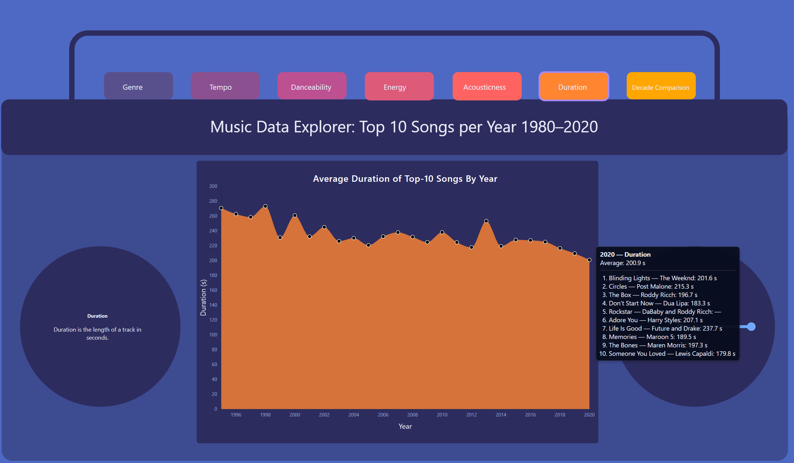
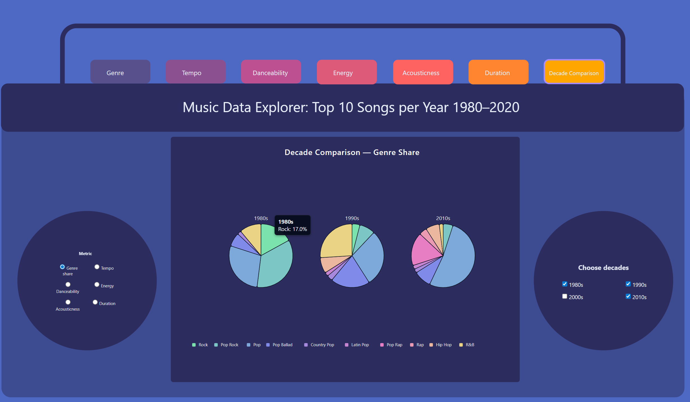

# CS6730Project
# Music Data Explorer: Top 10 Songs per Year (1980–2020) 📊

Interactive, boombox‑style data visualization of Billboard Top‑10 songs (1980–2020), built with HTML, CSS, and D3.js.  
The project lets you explore how **genre**, **tempo**, **danceability**, **energy**, **acousticness**, and **duration** evolved over time.

---

## Screenshots

### 🏠 Home Page

Stacked Bar Chart:

Hover tooltip:

### 📈 Feature Views (Example: Duration)
Average duration of the Top‑10 songs by year, with tooltip showing the Top‑10 songs for the hovered year and their individual values.

Line/area chart:

Hover tooltip:

### 🕐 Decade Comparison Views

Genre share by decade:

Tempo distribution by decade:

---

## Features

- **Boombox UI layout**
  - Central visualization panel with side “speakers” for contextual info and controls.
  - Top navigation tabs for switching between views.

- **Genre mix over time**
  - Stacked bar chart of Top‑10 genre composition by year.
  - Genre filter panel with quick “All / None” toggles.

- **Audio feature timelines**
  - Separate interactive view for:
    - Tempo  
    - Danceability  
    - Energy  
    - Acousticness  
    - Duration
  - Year‑range slider to focus on specific liperiods.
  - **Dot hover tooltip**:
    - Shows the year’s average value for the selected feature.
    - Lists the Top‑10 songs for that year with their individual feature values.

- **Decade comparison**
  - Switchable metric (genre share, tempo, danceability, energy, acousticness, duration).
  - Pie‑chart style genre comparison by decade.
  - Box‑plot style distribution comparison for numeric metrics.

---
